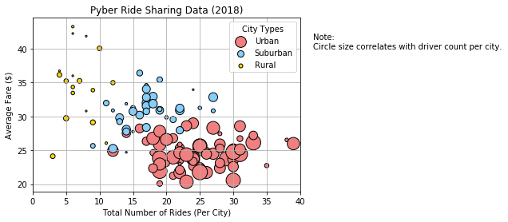
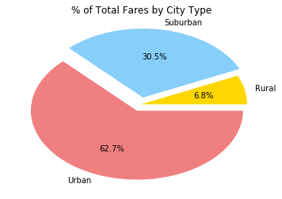
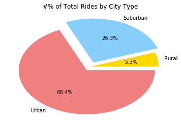
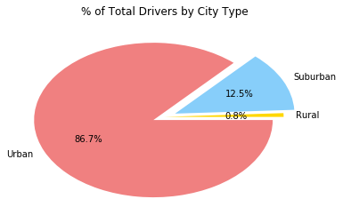

# Pyber Ride Sharing


```python
import pandas as pd
import matplotlib.pyplot as plt
%matplotlib inline
```


```python
city_df = pd.read_csv("./raw_data/city_data.csv")
ride_df = pd.read_csv("./raw_data/ride_data.csv")
```


```python
#city_df.head(2)
len(city_df)
```


    120


```python
ride_df.head(2)
```


<div>
<style scoped>
    .dataframe tbody tr th:only-of-type {
        vertical-align: middle;
    }

    .dataframe tbody tr th {
        vertical-align: top;
    }

    .dataframe thead th {
        text-align: right;
    }
</style>
<table border="1" class="dataframe">
  <thead>
    <tr style="text-align: right;">
      <th></th>
      <th>city</th>
      <th>date</th>
      <th>fare</th>
      <th>ride_id</th>
    </tr>
  </thead>
  <tbody>
    <tr>
      <th>0</th>
      <td>Lake Jonathanshire</td>
      <td>2018-01-14 10:14:22</td>
      <td>13.83</td>
      <td>5739410935873</td>
    </tr>
    <tr>
      <th>1</th>
      <td>South Michelleport</td>
      <td>2018-03-04 18:24:09</td>
      <td>30.24</td>
      <td>2343912425577</td>
    </tr>
  </tbody>
</table>
</div>


```python
ride_df['ride_id'].nunique()
```


    2375


```python
#merge 2 df on city
city_rides_merged_df = pd.merge(ride_df, city_df, on='city', sort=True)
```


```python
city_rides_merged_df['ride_id'].nunique()
```


    2375


```python
city_rides_merged_df.head()
```


<div>
<style scoped>
    .dataframe tbody tr th:only-of-type {
        vertical-align: middle;
    }

    .dataframe tbody tr th {
        vertical-align: top;
    }

    .dataframe thead th {
        text-align: right;
    }
</style>
<table border="1" class="dataframe">
  <thead>
    <tr style="text-align: right;">
      <th></th>
      <th>city</th>
      <th>date</th>
      <th>fare</th>
      <th>ride_id</th>
      <th>driver_count</th>
      <th>type</th>
    </tr>
  </thead>
  <tbody>
    <tr>
      <th>0</th>
      <td>Amandaburgh</td>
      <td>2018-03-05 02:15:38</td>
      <td>26.28</td>
      <td>906850928986</td>
      <td>12</td>
      <td>Urban</td>
    </tr>
    <tr>
      <th>1</th>
      <td>Amandaburgh</td>
      <td>2018-02-24 23:10:49</td>
      <td>43.66</td>
      <td>6573820412437</td>
      <td>12</td>
      <td>Urban</td>
    </tr>
    <tr>
      <th>2</th>
      <td>Amandaburgh</td>
      <td>2018-02-10 20:42:46</td>
      <td>36.17</td>
      <td>6455620849753</td>
      <td>12</td>
      <td>Urban</td>
    </tr>
    <tr>
      <th>3</th>
      <td>Amandaburgh</td>
      <td>2018-01-11 02:22:07</td>
      <td>29.24</td>
      <td>7279902884763</td>
      <td>12</td>
      <td>Urban</td>
    </tr>
    <tr>
      <th>4</th>
      <td>Amandaburgh</td>
      <td>2018-01-21 04:12:54</td>
      <td>9.26</td>
      <td>5528427024492</td>
      <td>12</td>
      <td>Urban</td>
    </tr>
  </tbody>
</table>
</div>


```python
city_rides_merged_df.info()
```

    <class 'pandas.core.frame.DataFrame'>
    Int64Index: 2375 entries, 0 to 2374
    Data columns (total 6 columns):
    city            2375 non-null object
    date            2375 non-null object
    fare            2375 non-null float64
    ride_id         2375 non-null int64
    driver_count    2375 non-null int64
    type            2375 non-null object
    dtypes: float64(1), int64(2), object(3)
    memory usage: 129.9+ KB


```python
city_rides_merged_df.columns
```


    Index(['city', 'date', 'fare', 'ride_id', 'driver_count', 'type'], dtype='object')


```python
city_rides_gb = city_rides_merged_df.groupby('city')
```


```python
#Average Fare ($) Per City
avFarebyCity = city_rides_gb['fare'].mean()
#Total Number of Rides Per City
numRidesPerCity = city_rides_gb['ride_id'].count()
#Total Number of Drivers Per City
numDriversPerCity = city_rides_gb['driver_count'].max()
#City Type (Urban, Suburban, Rural)
cityTypes = city_rides_gb['type'].max()
```


```python
fares_report_df = pd.DataFrame({'Average Fare ($) Per City':avFarebyCity,
             'Total Number of Rides Per City':numRidesPerCity,
             'Total Number of Drivers Per City':numDriversPerCity,
             'City Type (Urban, Suburban, Rural)':cityTypes})
```


```python
fares_report_df.head()
```


<div>
<style scoped>
    .dataframe tbody tr th:only-of-type {
        vertical-align: middle;
    }

    .dataframe tbody tr th {
        vertical-align: top;
    }

    .dataframe thead th {
        text-align: right;
    }
</style>
<table border="1" class="dataframe">
  <thead>
    <tr style="text-align: right;">
      <th></th>
      <th>Average Fare ($) Per City</th>
      <th>City Type (Urban, Suburban, Rural)</th>
      <th>Total Number of Drivers Per City</th>
      <th>Total Number of Rides Per City</th>
    </tr>
    <tr>
      <th>city</th>
      <th></th>
      <th></th>
      <th></th>
      <th></th>
    </tr>
  </thead>
  <tbody>
    <tr>
      <th>Amandaburgh</th>
      <td>24.641667</td>
      <td>Urban</td>
      <td>12</td>
      <td>18</td>
    </tr>
    <tr>
      <th>Barajasview</th>
      <td>25.332273</td>
      <td>Urban</td>
      <td>26</td>
      <td>22</td>
    </tr>
    <tr>
      <th>Barronchester</th>
      <td>36.422500</td>
      <td>Suburban</td>
      <td>11</td>
      <td>16</td>
    </tr>
    <tr>
      <th>Bethanyland</th>
      <td>32.956111</td>
      <td>Suburban</td>
      <td>22</td>
      <td>18</td>
    </tr>
    <tr>
      <th>Bradshawfurt</th>
      <td>40.064000</td>
      <td>Rural</td>
      <td>7</td>
      <td>10</td>
    </tr>
  </tbody>
</table>
</div>


```python
#Urban city details
urbanCities = city_rides_merged_df[city_rides_merged_df['type']=='Urban']
urbanRideCount = urbanCities.groupby(["city"]).count()["ride_id"]
urbanAvgFare = urbanCities.groupby(["city"]).mean()["fare"]
urbanDriverCount = urbanCities.groupby(["city"]).mean()["driver_count"]
```


```python
print(len(urbanRideCount))
print(len(urbanAvgFare))
```

    66
    66


```python
#Rural city details
ruralCities = city_rides_merged_df[city_rides_merged_df['type']=='Rural']
ruralRideCount = ruralCities.groupby(["city"]).count()["ride_id"]
ruralAvgFare = ruralCities.groupby(["city"]).mean()["fare"]
ruralDriverCount = ruralCities.groupby(["city"]).mean()["driver_count"]
```


```python
print(len(ruralRideCount))
print(len(ruralAvgFare))
```

    18
    18


```python
#Suburban city details
suburbanCities = city_rides_merged_df[city_rides_merged_df['type']=='Suburban']
suburbanRideCount = suburbanCities.groupby(["city"]).count()["ride_id"]
suburbanAvgFare = suburbanCities.groupby(["city"]).mean()["fare"]
suburbanDriverCount = suburbanCities.groupby(["city"]).mean()["driver_count"]
```


```python
print(len(suburbanRideCount))
print(len(suburbanAvgFare))
```

    36
    36


```python
#Scatter Plot the Urban city details
plt.scatter(urbanRideCount, 
            urbanAvgFare, 
            s=5*urbanDriverCount, c="lightcoral", 
            edgecolor="black", linewidths=1, marker="o", 
            alpha=1, label="Urban")
#Scatter Plot the Suburban city details
plt.scatter(suburbanRideCount, 
            suburbanAvgFare, 
            s=5*suburbanDriverCount, c="lightskyblue", 
            edgecolor="black", linewidths=1, marker="o", 
            alpha=1, label="Suburban")
#Scatter Plot the Rural city details
plt.scatter(ruralRideCount, 
            ruralAvgFare, 
            s=5*ruralDriverCount, c="gold", 
            edgecolor="black", linewidths=1, marker="o", 
            alpha=1, label="Rural")

plt.title('Pyber Ride Sharing Data (2018)')
plt.xlabel('Total Number of Rides (Per City)')
plt.ylabel('Average Fare ($)')
plt.xlim((0,40))
plt.grid(True)

plt.legend( loc="best", title="City Types")

# Incorporate a text label regarding circle size
plt.text(42, 40, "Note:\nCircle size correlates with driver count per city.")

plt.show()
```





```python
#Calculations for pie chart
#% of Total Fares by City Type
perFaresByCityType = (city_rides_merged_df.groupby('type').sum()['fare'] / city_rides_merged_df['fare'].sum()) * 100
```


```python
# Draw the Pie Chart
plt.pie(perFaresByCityType, 
        labels=["Rural", "Suburban", "Urban"], 
        colors=["gold", "lightskyblue", "lightcoral"], 
        explode=[0, 0.1, 0.1], 
        autopct='%1.1f%%')
plt.title("% of Total Fares by City Type")

# Show Figure
plt.show()
```





```python
#% of Total Rides by City Type
perTotRidesByCityType = (city_rides_merged_df.groupby('type').count()['ride_id'] / city_rides_merged_df['ride_id'].count()) * 100
```


```python
#Draw pie chart
plt.pie(perTotRidesByCityType, 
        labels=["Rural", "Suburban", "Urban"], 
        colors=["gold", "lightskyblue", "lightcoral"], 
        explode=[0, 0.1, 0.1], 
        autopct='%1.1f%%')
plt.title("#% of Total Rides by City Type")

# Show Figure
plt.show()
```





```python
city_rides_merged_df.columns
```


    Index(['city', 'date', 'fare', 'ride_id', 'driver_count', 'type'], dtype='object')


```python
#% of Total Drivers by City Type
perTotDriversByCityType = (city_rides_merged_df.groupby('type').sum()['driver_count'] / city_rides_merged_df['driver_count'].sum()) * 100
```


```python
# Draw the Pie Chart
plt.pie(perTotDriversByCityType, 
        labels=["Rural", "Suburban", "Urban"], 
        colors=["gold", "lightskyblue", "lightcoral"], 
        explode=[0, 0.1, 0.1], 
        autopct='%1.1f%%')
plt.title("% of Total Drivers by City Type")

# Show Figure
plt.show()
```




